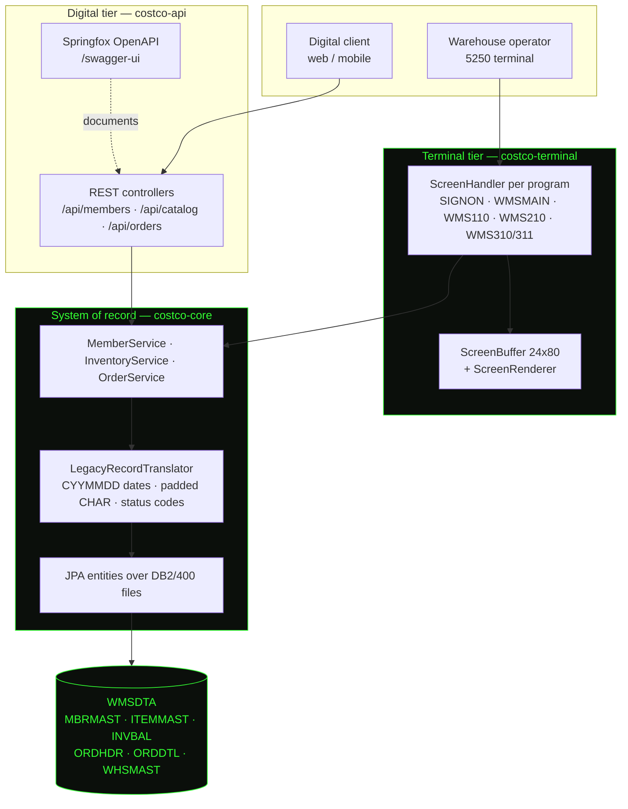

# Costco WMS — Legacy Modernization Reference

> **This is not real Costco code.** It is a reference stand-in built for a demonstration:
> a small warehouse-management application written the way a long-lived IBM i shop writes
> them, so that an autonomous coding agent has something genuine to modernize. No Costco
> source, data, branding, or internal system is reproduced here. Member names, item
> numbers, warehouses, and orders are invented. The IBM i platform details are modelled
> from public documentation and Costco's own public job postings, cited below.

A 1990s-style 5250 green-screen terminal and a modern REST API, both reading and writing
**the same system of record**. Place an order through the API, refresh the terminal, and
watch it appear in a 24×80 subfile.

---

## Why this application exists

Costco runs a very large business on a very thin gross margin, and its profit is
structurally a membership business rather than a merchandise one:

| Fact | FY2025 | Source |
|---|---|---|
| Total revenue | $275.2B | [FY2025 Form 10-K](https://www.sec.gov/Archives/edgar/data/909832/000090983225000101/cost-20250831.htm) |
| Gross margin (of net sales) | **11.12%** | 10-K |
| Membership fees | $5.32B — **51.3% of operating income** | 10-K, derived |
| Merchandise-only operating margin | ≈**1.9%** | 10-K, derived |
| Paid members / cardholders | 81.0M / 145.2M | 10-K |
| Warehouses / countries | 914 / 15 (e-commerce in only 8) | 10-K |
| Active SKUs per warehouse | **fewer than 4,000** | 10-K |
| Employees | 341,000, ~95% in warehouses and distribution | 10-K |

Costco's own 10-K attributes its cost advantage to "volume purchasing, efficient
distribution and reduced handling of merchandise" — **not** to technology. Technology
appears in the 10-K as a risk to be survived:

> "Availability and performance of our IT systems are vital to our business. Failure to
> successfully execute IT projects and have IT systems available to our business would
> adversely impact our operations." — FY2025 10-K, Item 1A

Meanwhile the legacy platform is not a rumour and is not being sunset. Costco's own job
postings recruit for it, naming **RPG (IV and free-format), CL, ILE, DB2/400**, and the
green-screen toolchain **SEU / SDA / PDM / RLU**, for teams called *Depot Solutions* and
*WHS Solutions* — with an application deadline in **October 2025**.

And the economics guarantee this stays hard: CEO Ron Vachris has said technology-driven
productivity gains are **passed to members as lower prices** rather than retained as
margin. So the modernization backlog is bounded by an IT capacity that can never
meaningfully expand. That is the problem this repository is a stand-in for.

<sub>A widely-shared claim that "Costco runs on hardware from 1988" traces to a single
unsourced social post and is wrong — IBM i runs on current IBM Power servers. Costco does
not disclose IT spend, so no "% of revenue vs. peers" comparison appears here.</sub>

---

## Architecture



The important property: **there is one database and one set of files.** The terminal is not
a view onto a copy. Both tiers go through the same services, and the same
`LegacyRecordTranslator` is the only code that knows what a CYYMMDD date is.

### Module map

| Module | Role | Bootable |
|---|---|---|
| `costco-core` | Domain models, JPA entities over the DB2/400-style files, repositories, services, seed data | no |
| `costco-terminal` | 5250 presentation: 24×80 buffer, renderer, screen handlers, session/screen stack | no |
| `costco-api` | REST controllers, Springfox OpenAPI, global error handling, the Spring Boot application | **yes** |

### The legacy schema

Physical files use the house naming standard: ten characters, upper case, a two-character
file prefix plus an abbreviated noun. There are **no declared foreign keys** — these files
were designed for record-level access from RPG, which enforced relationships in the program.

```
MBRMAST   MBMBRN  MBNAME  MBTIER  MBSTAT  MBJOIN  MBRNWD  MBWHS
ITEMMAST  IMITEM  IMDESC  IMDEPT  IMUOM   IMPRICE IMSTAT
INVBAL    IBRRN   IBWHS   IBITEM  IBLOCN  IBQOH   IBQALC  IBSTAT
ORDHDR    OHORDN  OHMBRN  OHWHS   OHSTAT  OHORDT  OHTOTL  OHSRC
ORDDTL    ODRRN   ODORDN  ODLINE  ODITEM  ODQORD  ODQALC  ODUOM  ODPRIC
WHSMAST   WHWHS   WHNAME  WHCITY  WHSTAT  WHCTRY
```

Dates are **CYYMMDD** — a century digit (0 = 19xx, 1 = 20xx) followed by YYMMDD, packed
into a numeric field. `0` is the legacy null. `INVBAL` and `ORDDTL` are keyed by **RRN**
(relative record number), which is how the RPG programs address them.

---

## Running it

Requires a JDK (17 or 21) and nothing else. No Docker, no database to install — H2 runs
in memory and seeds itself.

```bash
./mvnw clean package
```

```bash
java -jar costco-api/target/costco-api-1.0.0-SNAPSHOT.jar
```

| What | Where |
|---|---|
| **Green-screen terminal** | http://localhost:8080/wms |
| Swagger UI | http://localhost:8080/swagger-ui/index.html |
| OpenAPI document | http://localhost:8080/v3/api-docs |
| H2 console | http://localhost:8080/h2 (JDBC URL `jdbc:h2:mem:wmsdta`) |

### Using the terminal

Sign on with any user id — **there is no authentication**; the password field is ignored
entirely and exists only because a 5250 session without one would not read as one.

| Key | Action |
|---|---|
| `Enter` | Submit the whole screen |
| `F3` | Exit the program (returns to the menu; signs off from the menu) |
| `F5` | Refresh — reread from the database |
| `F7` / `F8` | Roll down / roll up through a subfile |
| `F11` | Alternate view (WMS210 swaps to department / UM / price) |
| `F12` | Cancel — back up one level |
| `Tab` | Move between input fields |

`F3` and `F12` are deliberately different: F3 leaves the program, F12 backs up one level
and keeps the stack.

### Seeing both tiers hit the same files

Place an order through the API:

```bash
curl -s -X POST http://localhost:8080/api/orders -H 'Content-Type: application/json' -d '{"memberNumber":"111000000042","warehouseCode":"W001","lines":[{"itemNumber":"1204590","quantity":12}]}'
```

Then open the terminal, take option **3** from the menu, and the order is at the top of the
subfile with source `WEB` — allocated against the same `INVBAL` rows that WMS210 displays.

---

## The modernization work this repo is waiting for

Everything below is real, currently present, and deliberately so.

| Debt | Detail |
|---|---|
| **Spring Boot 2.7.18** | Final 2.7.x release; out of OSS support |
| **`javax.*` everywhere** | `javax.persistence`, `javax.validation`, `javax.servlet` — the Jakarta namespace migration |
| **Springfox 3.0.0** | The project's only release, unmaintained, **no Spring Boot 3 support at all** — a hard blocker, not an incidental dependency |
| **`ant_path_matcher` workaround** | `application.properties` forces the pre-Boot-2.6 path matching strategy; without it Springfox fails at startup |
| **`io.swagger.annotations`** | `@Api` / `@ApiOperation` on every controller, all needing conversion to `@Tag` / `@Operation` |
| **Coverage at 5.0%** | Measured, see below |

### Test coverage baseline

Measured by JaCoCo on the current commit:

| Module | Instruction coverage |
|---|---|
| `costco-core` | 2.2% (51 / 2,295) |
| `costco-terminal` | 5.8% (229 / 3,966) |
| `costco-api` | 9.4% (71 / 754) |
| **Overall** | **5.0% (351 / 7,015)** |

Reports land at `<module>/target/site/jacoco/index.html` after `./mvnw clean verify`.

There is real, testable behaviour sitting uncovered — CYYMMDD encoding round-trips and its
zero-date sentinel, non-nettable stock excluded from availability, partial allocation
producing backordered lines, order totals recomputed rather than trusted from `OHTOTL`,
subfile paging boundaries, and the attribute-cell rule in `ScreenBuffer`.

---

## Resetting between demo runs

```bash
npm run demo:reset
```

Restores the repository to the `demo-start` tag and rebuilds. **This discards all local
changes and untracked files** — it prints exactly what it will delete and asks for
confirmation. `scripts/reset-demo.sh --force` skips the prompt for unattended use.
